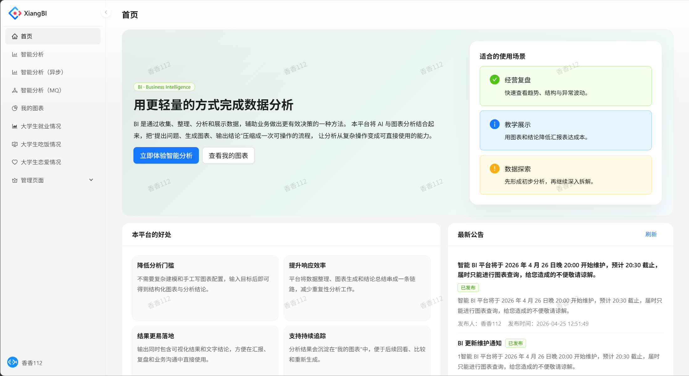
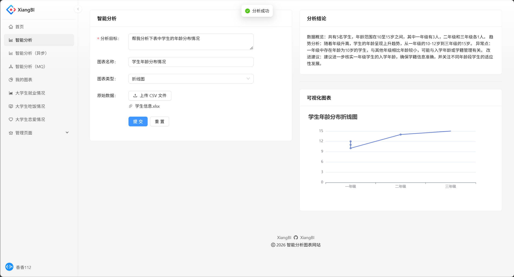
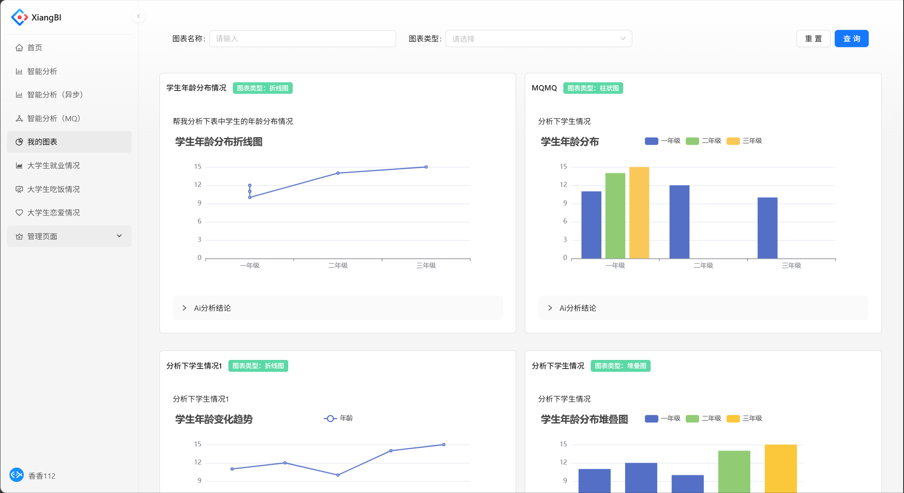
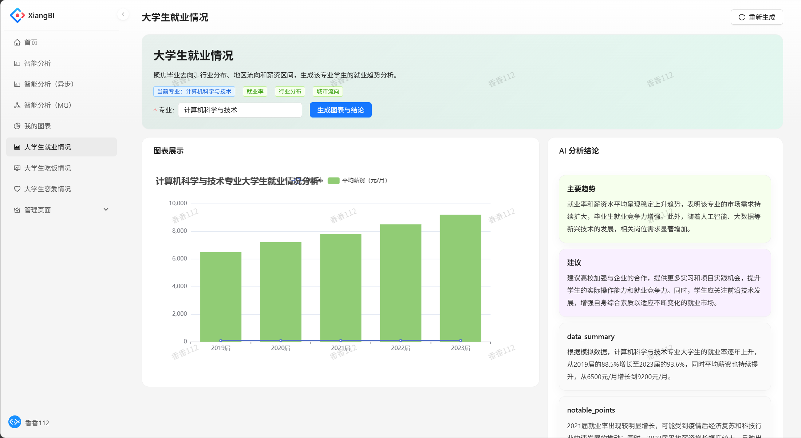

<div align="center">


# 🚀 享 · XiangBI 智能数据分析平台

### ✨ 不只是图表，更是智能分析

<p>
  
  
  
  
  
</p>

</div>

---

# ✨ 项目简介

**享 · XiangBI** 是一个 **前后端分离的智能 BI 平台**，支持用户上传数据文件，自动生成图表并提供分析结果。

相比传统 BI 工具，本项目具有以下优势：

- 🚀 更轻量（无需复杂部署）
- 🧠 更智能（AI + 自动分析）
- 🎯 更易用（开箱即用）

适用场景：

- 个人项目
- 数据分析练手
- 中小型业务系统

---

# 🖼️ 项目预览

## 🏠 首页


## 📊 图表分析


## 📁 历史分析


## 👤 模板分析


---

# 🧩 核心功能

## ✨ 数据能力

- 📊 数据可视化（ECharts）
- 📁 Excel 上传解析（EasyExcel）
- 📌 图表自动生成

## 🤖 智能分析

- 🧠 AI + 规则分析模型
- 📈 自动生成数据结论
- 🔍 数据趋势洞察

## ⚙️ 系统能力

- 👤 用户系统（登录 / 权限）
- 📂 图表管理
- ⚡ 异步任务（RabbitMQ）
- 🔐 接口文档（Knife4j）

---

# 🛠️ 技术栈

## 🧱 后端

- Spring Boot
- MyBatis-Plus
- MySQL
- Redis / Redisson
- RabbitMQ
- EasyExcel
- 腾讯云 COS
- Hutool
- Lombok

---

## 🎨 前端

- React
- Umi Max
- Ant Design Pro
- TypeScript
- ECharts
- Axios

---

# 📂 项目结构

```bash
xiangBI
├── XiangBI-backend
├── XiangBI-frontend
├── images
└── README.md
````

---

# 🚀 快速启动

## 1️⃣ 克隆项目

```bash
git clone https://github.com/xiangxiang62/xiangBI.git
cd xiangBI
```

---

## ⚙️ 后端启动

```bash
cd XiangBI-backend
mvn spring-boot:run
```

接口文档：

```
http://localhost:8123/doc.html
```

---

## 🎨 前端启动

```bash
cd XiangBI-frontend
npm install
npm run start:dev
```

---

# 📸 项目亮点

* 🌈 现代化 UI（Ant Design Pro）
* 📊 数据 → 图表 → 结论 一体化
* ⚡ 异步任务处理大数据
* 🧠 智能 BI 分析能力
* 🧱 清晰的前后端分离架构

---

# 🔮 后续规划

* [ ] 🤖 AI 自动生成分析报告
* [ ] 📊 多维度数据分析
* [ ] 🔗 图表分享
* [ ] 🔐 权限系统升级
* [ ] 🚀 大数据优化

---

# 👨‍💻 作者

**xiangxiang62**

👉 [https://github.com/xiangxiang62](https://github.com/xiangxiang62)

---

# ⭐ 支持一下

如果你觉得这个项目不错：

* ⭐ Star 一下
* 🍴 Fork 一下
* 💬 提 Issue / PR

---

🔥 **享 · XiangBI —— 让数据说话，让决策更聪明**
